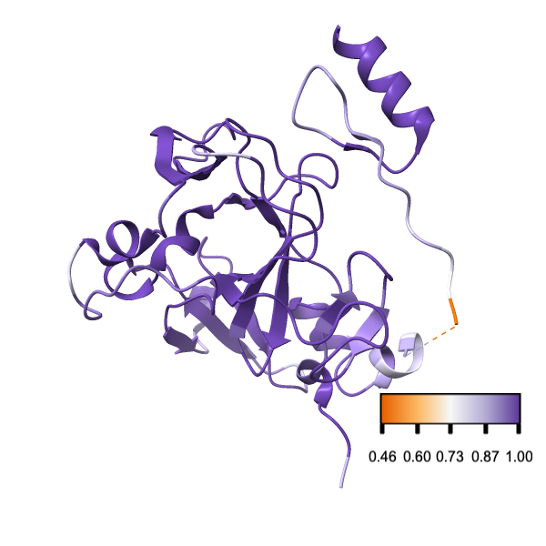
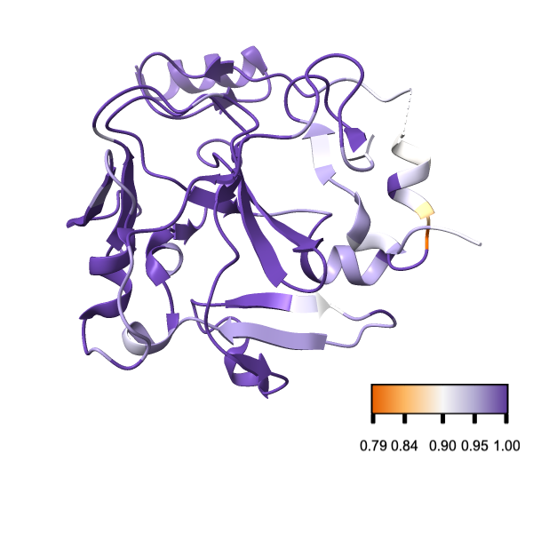

Visualizing alignment confidence
================================

In this example, we plot the alignment uncertainty of each position on the 3D structure of a protein.
We use the human PRDM9 protein as an example, starting with the OMA GROUP 976624, from th [OMA database](https://omabrowser.org/oma/home/). The group has 42 sequences.

We assume that all dependencies have been installed into a conda environment and activate it:

```bash
conda activate sgedtools-env
```

## Align sequences with two methods

We first align sequences with [Muscle5](https://www.drive5.com/muscle/):

```bash
muscle -align omagroup976624_PRDM9.fasta \
       -output omagroup976624_PRDM9_muscle.fasta
```

and then with [Clustal Omega](http://www.clustal.org/omega/):

```bash 
clustalo -i omagroup976624_PRDM9.fasta \
         -o omagroup976624_PRDM9_clustalo.fasta \
         -v
```

We then compare the two alignments using the `bppAlnScore` program from the [Bio++ Program Suite](https://biopp.github.io/) (version >3.0 needed):


```bash 
bppalnscore param=AlnScores.bpp
```

## Map alignment scores on the protein structure

We blast the human PRDM9 sequence on the Protein Data Bank to find the most relevent structure.
The first result is entry 4IJD, which only covers the methyltransferase domain. We create a structure index and convert the coordinates of the alignment scores:

```bash
sged-create-structure-index \
    --pdb-id 4IJD \
    --pdb-format remote:mmCif \
    --alignment omagroup976624_PRDM9_muscle.fasta \
    --alignment-format fasta \
    --gap-open -2 \
    --output outputomagroup976624_PRDM9_PdbIndex.txt
```

and 

```bash
sged-translate-coords \
    --sged omagroup976624_PRDM9_scores.sged \
    --group Site \
    --index outputomagroup976624_PRDM9_PdbIndex.txt \
    --output omagroup976624_PRDM9_scores_PDB.sged \
    --name PDB
```

Finally, we export the sum of pairwise scores into a Chimera attribute file. Unmapped positions will be ignored:

```bash
sged-sged2defattr \
    --sged omagroup976624_PRDM9_scores_PDB.sged \
    --group PDB \
    --variable SumOfPairsScore  \
    --output omagroup976624_PRDM9_scores_PDB.defattr
```

## Visualizing the 3D Protein Structure

We will use the [https://www.rbvi.ucsf.edu/chimerax/](ChimeraX) software to visualize the results.
Open the 4IJD structure into the program:

```
open 4ijd
hide all
show /B cartoons
```

We set the working directory to the current one and load the attributes:

```
open omagroup976624_PRDM9_scores_PDB.defattr
color byattribute SumOfPairsScore palette puor key true
```

Save the result:

```
zoom 1.3
save PRDM9.png supersample 3 width 600 height 600
```



The domain corresponds to a relatively well aligned part of the sequence, with the exception of a region.

## Using a broader range of sequences

We use a similar approach to asses the alignment quality of the Hierarchical Orthologous Group (HOG).
HOG:D0643448 from the OMA database contains 58 PRDM9 sequences, with duplicates in some species.
We assess the confidence of the original OMA alignment by comparing it to a muscle realignment.

```bash
muscle -align HOG_D0643448.aln.fasta -output HOG_D0643448.aln_muscle.fasta
``

```bash 
bppalnscore param=AlnScores2.bpp
```

We then map the new scores on the structure after creating a structural index for the OMA alignment:

```bash
sged-create-structure-index \
    --pdb 4ijd.cif \
    --pdb-format mmCif \
    --alignment HOG_D0643448.aln.fasta \
    --alignment-format fasta \
    --gap-open -2 \
    --output HOG_D0643448_PdbIndex.txt
```

Note: we do not redownload the PDB structure but use the file downloaded in the previous step.

```bash
sged-translate-coords \
    --sged HOG_D0643448_scores.sged \
    --group Site \
    --index HOG_D0643448_PdbIndex.txt \
    --output HOG_D0643448_scores_PDB.sged \
    --name PDB
```

We export the sum of pairwise scores into a Chimera attribute file, ignoring unmapped positions:

```bash
sged-sged2defattr \
    --sged HOG_D0643448_scores_PDB.sged \
    --group PDB \
    --variable SumOfPairsScore  \
    --output HOG_D0643448_scores_PDB.defattr
```

We can then visualize the scores:

```
open 4ijd
hide all
show /B cartoons
open HOG_D0643448_scores_PDB.defattr
color byattribute SumOfPairsScore palette puor key true
zoom 1.3
save PRDM9_HOG.png supersample 3 width 600 height 600
```



