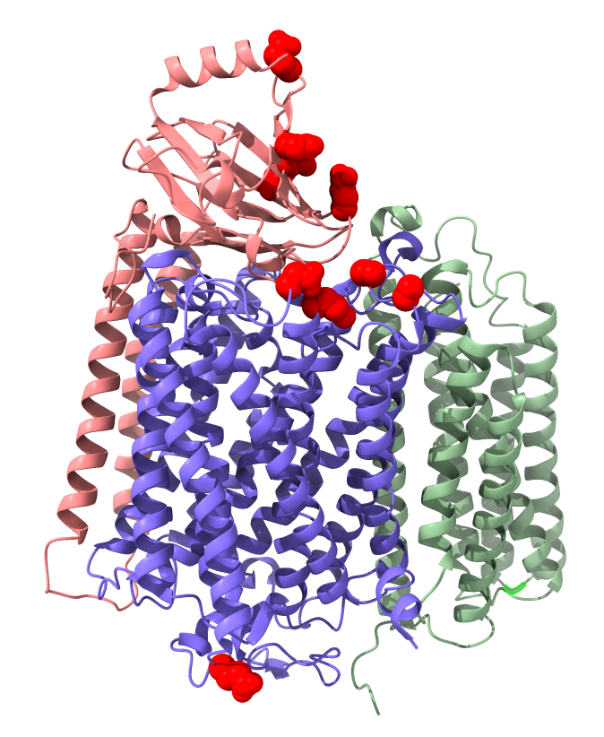

Inter-protein coevolution
=========================

We look at coevolution between the three cox1, cox2, and cox3 subunits of the the cytochrome oxidase.
We would like to test whether there is coevolution between subunits and concatenate the three input alignments.


## Concatenate alignments and create alignment indexes

We can use the `sged-concatenate-alignments` program to do all operations:

```bash
python3 ../../src/sged-concatenate-alignments.py \
    --aln1 ../data/cox1.aln.fasta \
    --aln2 ../data/cox2.aln.fasta \
    --output-aln cox12.aln.fasta \
    --output-sged cox12.index.sged
```

This creates a concatenated fasta alignment (`cox12.aln.fasta`) and a file containing all relative and absolute positions:

```
Group	AlnPos	AlnIndex	AlnId
[1]	[1]	1	cox1.aln.fasta
[2]	[2]	1	cox1.aln.fasta
[3]	[3]	1	cox1.aln.fasta
[4]	[4]	1	cox1.aln.fasta
[5]	[5]	1	cox1.aln.fasta
...
[518]	[518]	1	cox1.aln.fasta
[519]	[519]	1	cox1.aln.fasta
[520]	[520]	1	cox1.aln.fasta
[521]	[521]	1	cox1.aln.fasta
[522]	[522]	1	cox1.aln.fasta
[523]	[1]	2	cox2.aln.fasta
[524]	[2]	2	cox2.aln.fasta
[525]	[3]	2	cox2.aln.fasta
[526]	[4]	2	cox2.aln.fasta
[527]	[5]	2	cox2.aln.fasta
...
[748]	[226]	2	cox2.aln.fasta
[749]	[227]	2	cox2.aln.fasta
[750]	[228]	2	cox2.aln.fasta
[751]	[229]	2	cox2.aln.fasta
[752]	[230]	2	cox2.aln.fasta
```

To concatenate more than 2 alignments, we need to provide a list of files:

```bash
echo "../data/cox1.aln.fasta" > aln.lst
echo "../data/cox2.aln.fasta" >> aln.lst
echo "../data/cox3.aln.fasta" >> aln.lst
```

Then run the script:

```bash
python3 ../../src/sged-concatenate-alignments.py \
    --aln-list aln.lst \
    --output-aln coxall.aln.fasta \
    --output-sged coxall.index.sged
```

The result looks like:

```bash
Group	AlnPos	AlnIndex	AlnId
[1]	[1]	1	cox1.aln.fasta
[2]	[2]	1	cox1.aln.fasta
[3]	[3]	1	cox1.aln.fasta
...
[520]	[520]	1	cox1.aln.fasta
[521]	[521]	1	cox1.aln.fasta
[522]	[522]	1	cox1.aln.fasta
[523]	[1]	2	cox2.aln.fasta
[524]	[2]	2	cox2.aln.fasta
[525]	[3]	2	cox2.aln.fasta
...
[750]	[228]	2	cox2.aln.fasta
[751]	[229]	2	cox2.aln.fasta
[752]	[230]	2	cox2.aln.fasta
[753]	[1]	3	cox3.aln.fasta
[754]	[2]	3	cox3.aln.fasta
[755]	[3]	3	cox3.aln.fasta
...
[1011]	[259]	3	cox3.aln.fasta
[1012]	[260]	3	cox3.aln.fasta
[1013]	[261]	3	cox3.aln.fasta
```

This file is for info only. The script creates three index files, one per input alignment, which we will use.

## Reconstruct the phylogeny and run the coevolution analysis

Create a phylogenetic tree from the concatenated alignment. We use the PhyML program withing [http://pbil.univ-lyon1.fr/software/seaview3](SeaView) (LG+Gamma model, best of NNI + SPR, aLRT bootstraps), and save the unrooted tree. The alignment is pretty good so all sites are used. Using bppPhyView, we collapse all nodes with a bootstrap value lower then 0.6.
We then use [https://jydu.github.io/comap/](CoMap) to re-fit the model and perform substitution mapping in order to detect coevolving sites.

```bash
comap param=comap.bpp
Rscript computePValues.R
```

## Visualize the result on the protein structure

We create a structure index for each input alignments. We start with cox1, for which we download the structure 6J8M:

```bash
python3 ../../src/sged-create-structure-index.py \
         --pdb-id 6J8M \
         --pdb-format remote:mmCif \
         --alignment cox1.aln.fasta \
         --output cox1_PdbIndex.txt
```
This maps to chain A.
We then do the two other units, using the downloaded structure.

```bash
python3 ../../src/sged-create-structure-index.py \
         --pdb 6j8m.cif \
         --pdb-format mmCif \
         --alignment ../data/cox2.aln.fasta \
         --output cox2_PdbIndex.txt

python3 ../../src/sged-create-structure-index.py \
         --pdb 6j8m.cif \
         --pdb-format mmCif \
         --alignment ../data/cox3.aln.fasta \
         --output cox3_PdbIndex.txt
```

cox2 maps to chain B and cox3 to chain C.

We then combine the indexes to map each PDB chain to the concatenated alignment:

```bash
python3 ../../src/sged-liftover-index.py \
         --index1 cox1.aln.fasta_AlnIndex.txt \
         --index2 cox1_PdbIndex.txt \
         --output cox1.aln.fasta_PdbIndex.txt

python3 ../../src/sged-liftover-index.py \
         --index1 cox2.aln.fasta_AlnIndex.txt \
         --index2 cox2_PdbIndex.txt \
         --output cox2.aln.fasta_PdbIndex.txt

python3 ../../src/sged-liftover-index.py \
         --index1 cox3.aln.fasta_AlnIndex.txt \
         --index2 cox3_PdbIndex.txt \
         --output cox3.aln.fasta_PdbIndex.txt
```

We then merge the three indexes into a single one, since they are complementary:

```bash
python3 ../../src/sged-merge-indexes.py \
         --index cox1.aln.fasta_PdbIndex.txt \
         --index cox2.aln.fasta_PdbIndex.txt \
         --index cox3.aln.fasta_PdbIndex.txt \
         --output coxall_PdbIndex.txt
```

Finally, we get the PDB coordinates of each coevolving group:

```bash
python3 ../../src/sged-translate-coords.py \
         --sged coxall_predictions_pvalues.sged \
         --index coxall_PdbIndex.txt \
         --output coxall_predictions_pvalues_tln.sged
```

We can then visualize the results, for instance using the [https://www.rbvi.ucsf.edu/chimerax/](ChimeraX) program:

```
name group1 /B:45,87,99
name group2 /B:147,170 /C:189,191
name group3 /A:188,419,223 /B:211 /C:178
name group4 /A:492 /B:130,152 /C:179,55
name group5 /A:136 /B:191,150,213 /C:154
name group6 /A:141,475,478,259 /B:113,118
name group7 /A:75,482,110 /B:143 /C:144,151,206
name group8 /A:46,453 /B:61,97,146,202,226 /C:115
name group9 /A:65,71,86,92,100,171,208,273,292 
name group10 /A:335,337,400,460 /B:141,168 /C:212,53,52
name group11 /A:160,180 /B:57,82,105,48,58,63,124 /C:77
name group12 /A:50,137,52,139,481 /B:119,157,107,114,153
```

We plot group 11 as an example:

```
hide all
ribbon /A /B /C
color /A /B /C bychain
show group12
color group12 red
```

The coevolving residues are shown in red:



