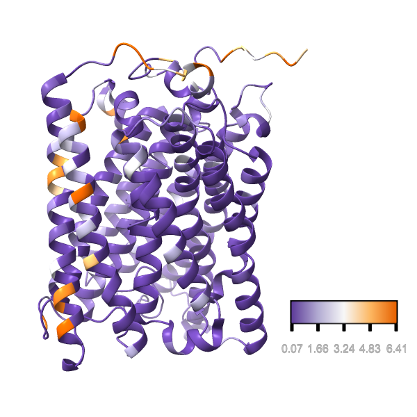

# Mapping Evolutionary Rates on a Protein Structure


This example provide a ConSurf-like analysis[^1]. It uses the Bio++ Program Suite to compute evolutionary rates and ChimeraX to visualize the results. The analysis is done on the coxI gene. 

## Computing evolutionary rates

We use the maximum likelihood tree generated from the concatenation of the coxI, II and III genes (see the `concatenate_alignments` example. We reestimate the model parameters for the coxI gene and fit a Gamma distribution of rates with 10 classes. Sites with less than 50% missing data are included in the analysis.

```bash
bppml param=ML.bpp
```

The output file named `cox1.sged_1` contains several measures of evolutionary rates for each site in the alignment. We we will use the posterior rate estimate (`pr` column). The `bppML` program directly generates SGED files.

## Getting a PDB file and mapping the rates on the structure

We create a structure index using the structure 6J8M:

```bash
sged-create-structure-index \
    --pdb-id 6J8M \
    --pdb-format remote:mmCif \
    --alignment ../data/cox1.aln.fasta \
    --output cox1_PdbIndex.txt
```
This maps to chain A.
We then get the PDB coordinates of each alignment position, which are stores in the `Sites` column:

```bash
sged-translate-coords \
    --sged cox1.sged_1 \
    --group Sites \
    --index cox1_PdbIndex.txt \
    --output cox1_tln.sged
```

## Visualizing the 3D Protein Structure

We will use the [https://www.rbvi.ucsf.edu/chimerax/](ChimeraX) software to visualize the results. We export the rate estimates into an attribute file:

```bash
sged-sged2defattr \
    --sged cox1_tln.sged \
    --group TlnGroup \
    --variable pr  \
    --output cox1_rates.defattr
```

We then visualize the protein in ChimeraX:

```
open 6j8m
hide all
show /A cartoons
```

We set the working directory to the current one and load the attributes:

```
open cox1_rates.defattr
color byattribute pr palette ^puor key true
```

Save the result:

```
zoom 1.5
save cox1.png supersample 3 width 600 height 600
```



