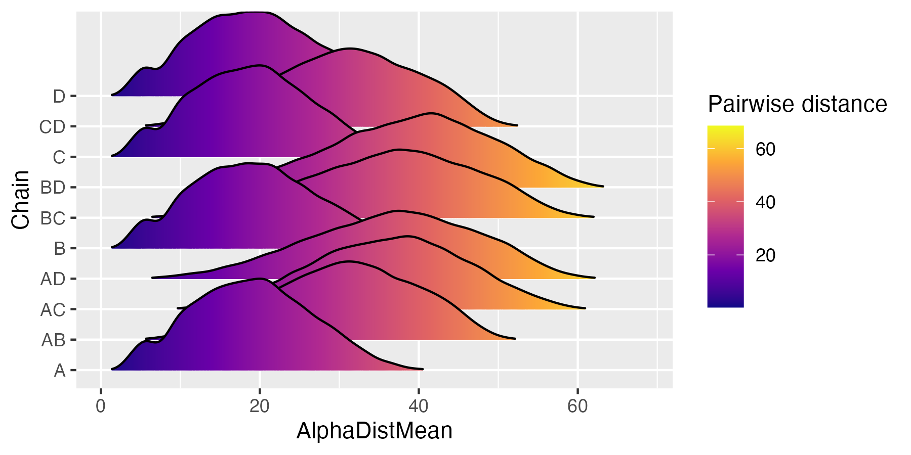

# List residues in a structure file

We list all the positions in the hemoglobin tetramer:

```bash
python3 ../../src/sged-structure-list.py \
    --pdb-id 1a3n \
    --pdb-format remote:mmCif \
    --output Hemoglobin.sged
```

We then look at all pairwise 3D distances. For this, we first need to list all possible pairs of residues:

```bash
python3 ../../src/sged-get-all-pairs.py \
    --sged Hemoglobin.sged \
    --output Hemoglobin-pairs.sged
```

This makes 163,307 pairs! We compute the Calpha distance for each pair, as well as the chain of each residue:

```bash
python3 ../../src/sged-structure-infos.py \
    --sged Hemoglobin-pairs.sged \
    --pdb 1a3n.cif \
    --pdb-format mmCif \
    --measure AlphaDist \
    --measure Chain \
    --output Hemoglobin-pairs-infos.sged
```

We can now use these results to compare the distribution of 3D distances of intra vs. inter subunit residue pairs:

```r
require(ggplot2)
require(ggridges)

dat <- read.table("Hemoglobin-pairs-infos.sged", header = TRUE)

p <- ggplot(dat, aes(x = AlphaDistMean, y = Chain, fill = after_stat(x))) + 
     geom_density_ridges_gradient(scale = 3, rel_min_height = 0.01) +
     scale_fill_viridis_c(name = "Pairwise distance", option = "C")
p

ggsave(p, filename = "PairwiseDistances.png", width = 6, height = 3)
```



Residues within subunits are closer to each other than to residues in other units.
Units A and B on the one hand, C and D on the other hand, are closer.

